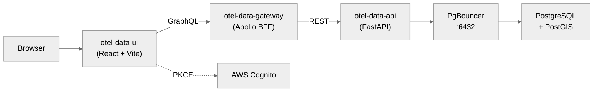

# otel-data-ui

[](https://github.com/stuartshay/otel-data-ui/actions/workflows/lint.yml)
[](https://github.com/stuartshay/otel-data-ui/actions/workflows/docker.yml)
[](https://hub.docker.com/repository/docker/stuartshay/otel-data-ui)
[](https://www.typescriptlang.org/)
[](https://react.dev/)
[](https://developer.mend.io/github/stuartshay/otel-data-ui)

React frontend consuming the [otel-data-gateway](https://github.com/stuartshay/otel-data-gateway)
GraphQL BFF for location and activity data visualization.

## Architecture



## Features

- **GraphQL data layer** via Apollo Client — paginated queries, caching
- **Interactive maps** with Leaflet / react-leaflet (OwnTracks + Garmin tracks)
- **Activity charts** with Recharts (elevation, speed, heart rate, temperature)
- **AWS Cognito authentication** — PKCE flow via oidc-client-ts
- **Runtime environment config** — container-friendly env injection at startup
- **New Relic browser agent** — Real User Monitoring (RUM)
- **Playwright E2E tests** — end-to-end testing against deployed services
- **shadcn/ui components** — Tailwind CSS + Radix UI primitives

## Stack

| Component     | Version           |
| ------------- | ----------------- |
| React         | 19.x              |
| Vite          | 7.x               |
| TypeScript    | 5.9               |
| Apollo Client | 4.x               |
| Tailwind CSS  | 4.x               |
| shadcn/ui     | Manual components |
| Leaflet       | 1.9               |
| Recharts      | 3.x               |

## Routes

| Path                  | Page                | Description                                            |
| --------------------- | ------------------- | ------------------------------------------------------ |
| `/`                   | Dashboard           | Overview stats, device list, sport breakdown           |
| `/locations`          | Locations           | OwnTracks GPS points with pagination and device filter |
| `/locations/:id`      | Location Detail     | Single location with all fields                        |
| `/garmin`             | Garmin Activities   | Activity table with sport filter                       |
| `/garmin/:activityId` | Garmin Detail       | Stats, elevation/speed charts, track map               |
| `/map`                | Unified Map         | Leaflet map with OwnTracks + Garmin points             |
| `/daily-summary`      | Daily Summary       | Combined daily activity table                          |
| `/references`         | Reference Locations | Saved location cards                                   |
| `/spatial`            | Spatial Tools       | Nearby point search and distance calculator            |

## Quick Start

```bash
# Setup
./setup.sh

# Development (hot reload)
npm run dev

# Open
open http://localhost:5173
```

### Prerequisites

- Node.js 24+
- npm

### Development Setup

```bash
git clone https://github.com/stuartshay/otel-data-ui.git
cd otel-data-ui
./setup.sh          # or: npm install
cp .env.example .env.local   # configure environment
npm run dev
```

## Environment Variables

Create `.env.local`:

```bash
VITE_GRAPHQL_URL=https://gateway.lab.informationcart.com
VITE_COGNITO_DOMAIN=homelab-auth.auth.us-east-1.amazoncognito.com
VITE_COGNITO_CLIENT_ID=5j475mtdcm4qevh7q115qf1sfj
VITE_COGNITO_REDIRECT_URI=https://data-ui.lab.informationcart.com/callback
VITE_COGNITO_ISSUER=https://cognito-idp.us-east-1.amazonaws.com/us-east-1_ZL7M5Qa7K
```

## Commands

```bash
npm run dev           # Development server (port 5173)
npm run build         # Production build
npm run lint          # ESLint
npm run lint:fix      # ESLint with auto-fix
npm run format        # Prettier format
npm run format:check  # Prettier check
npm run lint:spell    # Spell check
npm run test          # Vitest watch mode
npm run test:coverage # Vitest coverage run
npm run type-check    # TypeScript check
npm run lint:all      # All linters
```

## Testing

```bash
npm run test              # Vitest in watch mode
npm run test:run          # Single run
npm run test:coverage     # Coverage report
npx playwright test       # E2E tests (requires running services)
```

## CI/CD

| Workflow           | File                     | Purpose                                                              |
| ------------------ | ------------------------ | -------------------------------------------------------------------- |
| Lint and Validate  | `lint.yml`               | ESLint, TypeScript, cspell, markdownlint, tests, hadolint, npm audit |
| Docker             | `docker.yml`             | Build and push image to Docker Hub on master merge                   |
| Update Types       | `update-types.yml`       | Auto-PR when `@stuartshay/otel-graphql-types` is published           |
| Auto Approve       | `auto-approve.yml`       | Auto-approve PRs from renovate[bot] and dependabot[bot]              |
| Validate PR Branch | `validate-pr-branch.yml` | Ensure PRs target the correct base branch                            |

## Docker

```bash
docker build -t otel-data-ui .
docker run -p 8080:80 -e VITE_GRAPHQL_URL=https://gateway.lab.informationcart.com otel-data-ui
```

## Infrastructure

| Property      | Value                                     |
| ------------- | ----------------------------------------- |
| URL           | <https://data-ui.lab.informationcart.com> |
| Gateway       | <https://gateway.lab.informationcart.com> |
| K8s Namespace | otel-data-ui                              |
| Auth          | AWS Cognito (PKCE)                        |

## Related Repositories

- [otel-data-gateway](https://github.com/stuartshay/otel-data-gateway) — GraphQL BFF
- [otel-data-api](https://github.com/stuartshay/otel-data-api) — REST API
- [otel-ui](https://github.com/stuartshay/otel-ui) — Original React frontend
- [k8s-gitops](https://github.com/stuartshay/k8s-gitops) — K8s deployment
